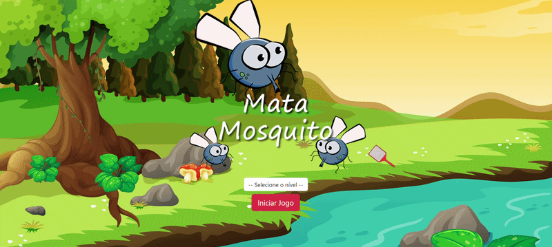

# 🦟 Mata Mosquito

Projeto desenvolvido com o objetivo de praticar conceitos de **JavaScript**, principalmente manipulação do DOM, eventos e controle de tempo em uma aplicação interativa.

## 🎮 Sobre o jogo

**Mata Mosquito** é um jogo em que o objetivo do jogador é eliminar todos os mosquitos que aparecem aleatoriamente na tela antes que o cronômetro chegue a zero.

Os mosquitos são gerados em posições aleatórias da página e desaparecem após um determinado tempo. Para eliminá-los, o jogador deve clicar sobre eles utilizando o mouse.

### Regras do jogo

- Cada mosquito aparece em uma posição aleatória da tela.
- O jogador deve clicar no mosquito antes que ele desapareça.
- Caso o mosquito desapareça sem ser eliminado, o jogador perde uma vida.
- O jogador possui um número limitado de vidas.
- Se todas as vidas forem perdidas antes do tempo acabar, o jogador perde a partida.
- Se o jogador sobreviver até o cronômetro chegar a zero, ele vence a partida.

## 🏆 Níveis de dificuldade

Antes de iniciar a partida, o jogador pode escolher um nível de dificuldade:

### Fácil
- Mosquitos permanecem mais tempo na tela.
- Menor velocidade de geração.

### Difícil
- Tempo de aparição intermediário.

### Chuck Norris
- Mosquitos desaparecem mais rapidamente.
- Exige maior velocidade e precisão do jogador.

Quanto maior a dificuldade selecionada, menor o tempo em que o mosquito permanece visível na tela.

## 🚀 Tecnologias utilizadas

- HTML5
- CSS3
- Bootstrap
- JavaScript

## 📚 Conceitos praticados

Durante o desenvolvimento deste projeto foram aplicados conceitos como:

- Manipulação do DOM
- Eventos de clique (`onclick`)
- Funções e variáveis em JavaScript
- Geração de posições aleatórias
- Temporizadores com `setInterval` e `setTimeout`
- Controle de vidas e pontuação
- Lógica de jogo
- Responsividade com Bootstrap

## ▶️ Como executar o projeto

1. Clone o repositório:

```bash
git clone https://github.com/caduaraujjo/game_mata_mosquito.git
```

2. Acesse a pasta do projeto:

```bash
cd game_mata_mosquito
```

3. Abra o arquivo `index.html` em seu navegador.

Ou utilize a extensão **Live Server** do VS Code para executar o projeto localmente.

## 📸 Preview



---

Desenvolvido para fins de estudo e prática de JavaScript.
